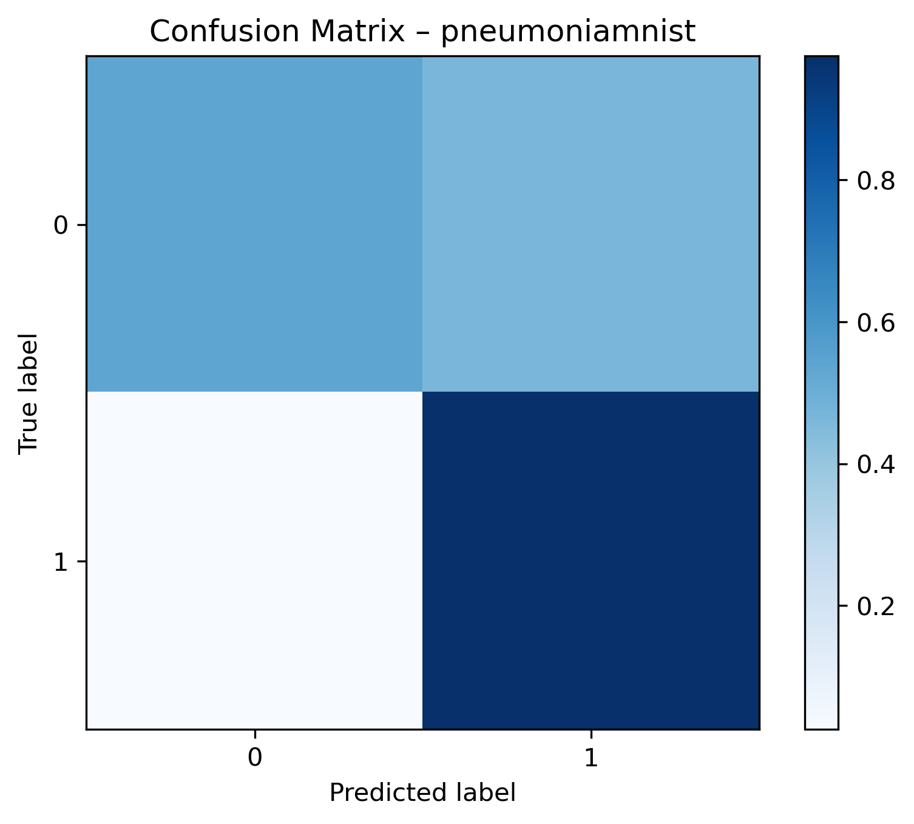
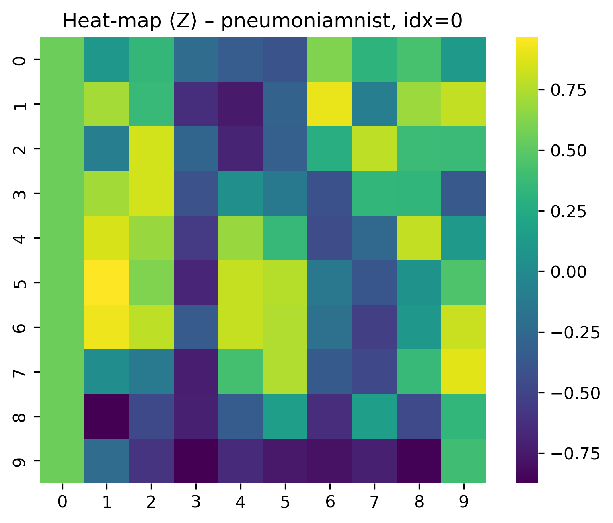
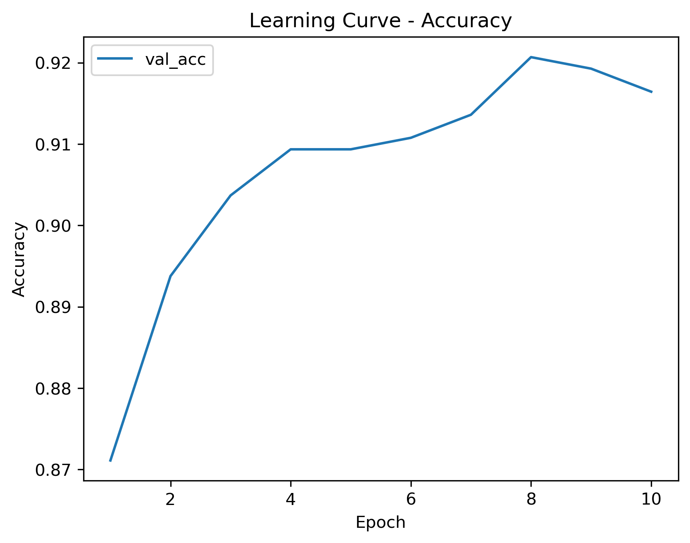
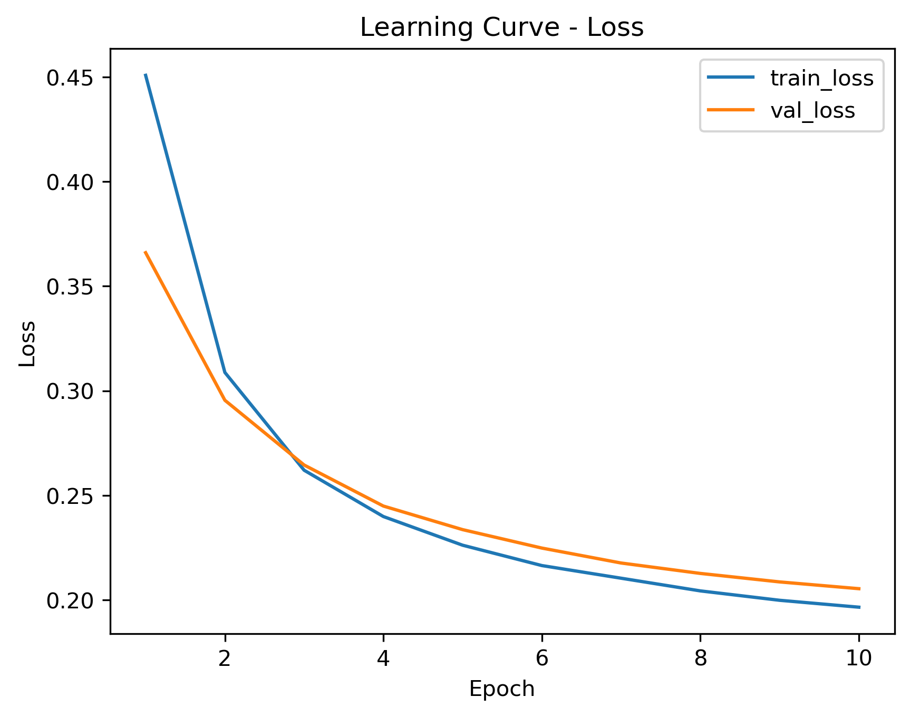

# QML-QCNN

## Abstract
Implementation of a Quantum Convolutional Neural Network using Qiskit and PyTorch for the medMNIST image dataset. The workflow converts RGB images to grayscale, extracts quantum features with a three-qubit convolution, and trains a small hybrid classifier. Reports include heatmaps and confusion matrices.

## Getting Started
| step | command |
|------|---------|
| clone | `git clone <repo-url>` |
| create env | `python3 -m venv .venv && source .venv/bin/activate` |
| install | `pip install -e "qcnn-medmnist[dev]"` |

## Requirements
- Python >=3.11
- Qiskit Aer backend (CPU) or optional CUDA GPU
- set `PYTHONHASHSEED` for reproducibility

## Project Architecture
```
raw images → Color2GrayNet → patches → QuantumConvLayer3 → FC → logits
```
Source code in [`qcnn-medmnist/src/qcnn_medmnist`](qcnn-medmnist/src/qcnn_medmnist).

## Project Workflow
1. **Preprocessing** – [`scripts/preprocess.py`](qcnn-medmnist/src/qcnn_medmnist/scripts/preprocess.py)
   trains `Color2GrayNet` from [`datasets/color2gray.py`](qcnn-medmnist/src/qcnn_medmnist/datasets/color2gray.py)
   and saves tensors under `data/processed/`.
2. **Training** – [`scripts/train.py`](qcnn-medmnist/src/qcnn_medmnist/scripts/train.py)
   calls `Trainer` in [`training/trainer.py`](qcnn-medmnist/src/qcnn_medmnist/training/trainer.py),
   which instantiates [`HybridQCNN`](qcnn-medmnist/src/qcnn_medmnist/models/hybrid_qcnn.py).
   The quantum layer `QuantumConvLayer3` is defined in
   [`models/layers.py`](qcnn-medmnist/src/qcnn_medmnist/models/layers.py)
   and uses the circuits from [`quantum/qconv.py`](qcnn-medmnist/src/qcnn_medmnist/quantum/qconv.py)
   and [`quantum/qpool.py`](qcnn-medmnist/src/qcnn_medmnist/quantum/qpool.py).
   Patch extraction and encoding reside in [`quantum/encoder.py`](qcnn-medmnist/src/qcnn_medmnist/quantum/encoder.py).
3. **Reports & Visualization** – [`scripts/report.py`](qcnn-medmnist/src/qcnn_medmnist/scripts/report.py)
   generates accuracy tables and confusion matrices; [`scripts/heatmap.py`](qcnn-medmnist/src/qcnn_medmnist/scripts/heatmap.py)
   draws activation heatmaps; [`scripts/plot_curves.py`](qcnn-medmnist/src/qcnn_medmnist/scripts/plot_curves.py)
   plots learning curves from `logs/<run>/metrics.csv`.

## Dataset / Benchmark
Uses the [medMNIST](https://medmnist.com/) collection. Preprocessed tensors are saved under `data/processed/`.

## Examples
- Notebook: [`QCNN_notebook.ipynb`](qcnn-medmnist/QCNN_notebook.ipynb)
- CLI: `qcnn-preprocess`, `qcnn-train`, `qcnn-report`, `qcnn-heatmap`, `qcnn-plot-curves`

## Results & Figures
Sample outputs can be found in [`reports/`](qcnn-medmnist/reports).





## Contacts
For questions contact Leonardo Tomei or Antonio Mosca (l.tomei9@studenti.unipi.it, a.mosca7@studenti.unipi.it).
